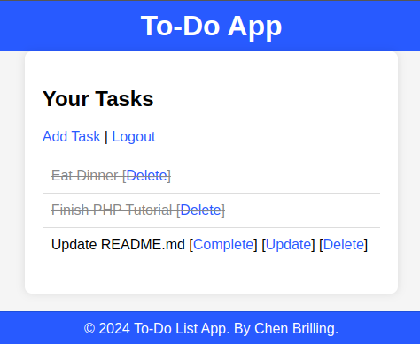

## To-Do List Application

### Overview
This To-Do List application is a simple web-based application designed to help you manage your tasks. It allows users to create, update, mark as complete, and delete tasks. Each user can securely manage their own tasks with a simple authentication.

This project was developed as an exercise to gain experience with PHP and to understand the basics of server-side scripting and database interactions. XAMPP is used as the local server environment.

<div align="center">
<a href="./images/Tasks_Image.png">
    
</a>
</div>


### Features
* User Authentication: Register and log in to manage personal tasks. 
* Passwords are securely hashed.
* Task Management:
* Add new tasks
* Update existing tasks
* Complete tasks
* Delete tasks


## Database Schema:
The project uses a MySQL database with the following schema:
```sql

CREATE TABLE users (
  id INT AUTO_INCREMENT PRIMARY KEY,
  username VARCHAR(50) NOT NULL UNIQUE,
  password VARCHAR(255) NOT NULL,
  created_at TIMESTAMP DEFAULT CURRENT_TIMESTAMP
);

CREATE TABLE tasks (
  id INT AUTO_INCREMENT PRIMARY KEY,
  user_id INT NOT NULL,
  task_name VARCHAR(255) NOT NULL,
  completed BOOLEAN DEFAULT FALSE,
  created_at TIMESTAMP DEFAULT CURRENT_TIMESTAMP
);
```


## Setup Instructions
1. Install XAMPP:
- Download and install XAMPP.
- Start Apache and MySQL from the XAMPP control panel.

---

2. Set Up the Database:

- Open phpMyAdmin from the XAMPP control panel.
- Create a new database named todo_app.
- Execute the provided SQL schemas to create the users and tasks tables.

---

3. Configure the Application:
-Place the project files in the htdocs directory of your XAMPP installation (e.g., C:\xampp\htdocs\todo-app).
-Ensure the includes/db.php file contains the correct database connection settings.

---

4. Run the Application:

Open your web browser and navigate to http://localhost/todo-app.
You should see the login page. Register a new user and start managing your tasks.

---